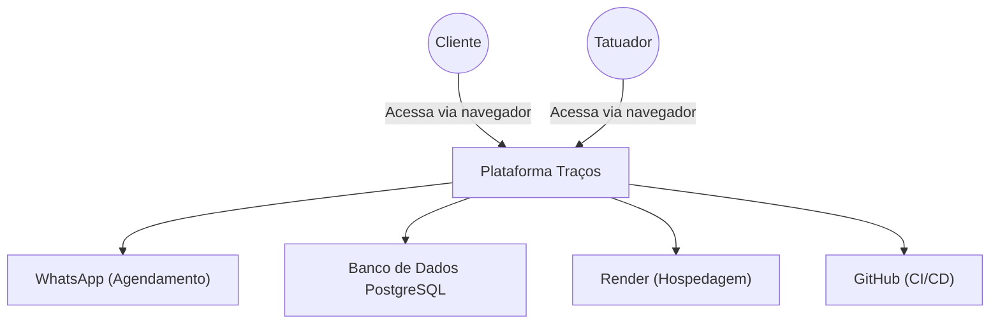
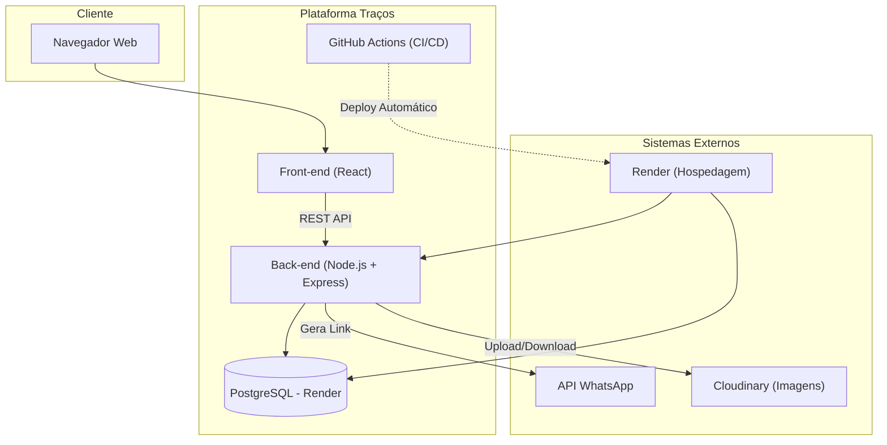
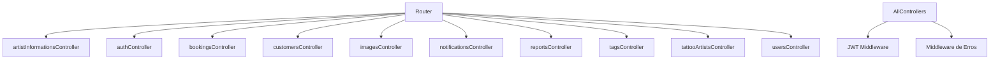
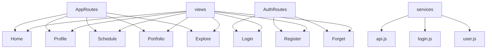

# Modelo C4 - Projeto Traços

## Nível 1: Diagrama de Contexto

## Nível 2: Diagrama de Contêiner

## Nível 3: Diagrama de Componentes

### Back-end (Node.js + Express)

### Front-end (React)

---

*Este modelo C4 resume a arquitetura do Projeto Traços considerando seus componentes principais e a interação entre usuários e sistemas internos/externos.*

