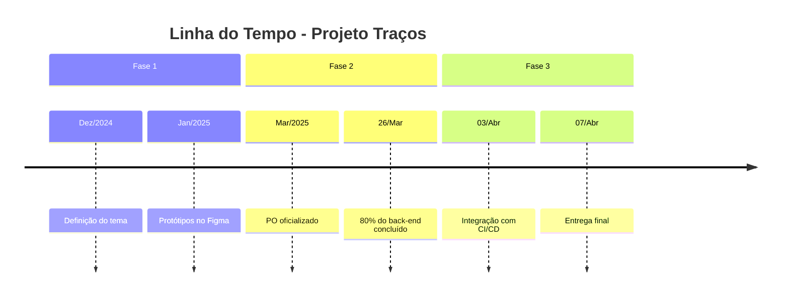

# Documento de Postmortem - Projeto Traços

## Visão Geral

- **Período do Projeto**: Dezembro/2024 a Abril/2025  
- **Equipe**: 4 integrantes (Product Owner, Front-end, Back-end, Design)  
- **Tecnologias**: React, Node.js, Express, PostgreSQL, Sequelize, Figma  

## Resultados Atingidos

| Área              | Resultado                                                                                                                                 |
|-------------------|-------------------------------------------------------------------------------------------------------------------------------------------|
| MVP               | Entregue com login, perfil do tatuador, portfólio de tatuadores, Central de Controle de Agendamentos, Menu Explorar                                                          |
| Design            | Protótipos de alta fidelidade validados no Figma                                                                                         |
| Testes            | Cobertura de 100% no back-end com Jest, testes de integração com Postman/Newman            |
| Gestão de Projeto | Adoção bem-sucedida do Trello com etiquetagem e sinalização de dependências após março                                                  |

## Pontos Fortes

### Comunicação e Organização

- Reuniões semanais produtivas com atas registradas
- Decisões rápidas e colaborativas via WhatsApp
- Gestão das tarefas através do Trello

### Técnicos

- Arquitetura escalável com autenticação via JWT e uso de middlewares
- Banco de dados hospedado desde o início no Render
- Estrutura de testes definida e aplicada (Jest, Postman/Newman)

### Design

- Guia de identidade visual completo (cores, fontes, layout)
- Navegação intuitiva
- Protótipos validados pelo time feitos no Figma

## Principais Desafios

| Problema                               | Causa Identificada                        | Impacto no Projeto                        |
|----------------------------------------|-------------------------------------------|-------------------------------------------|
| Falta de centralização na gestão       | Ausência de PO nas etapas iniciais        | Retrabalho e baixa priorização            |
| Desorganização no início do projeto    | Falta de ferramenta de gestão estruturada | Atrasos e tarefas paralelas mal definidas |
| Integração de tecnologias              | Curva de aprendizado com ORM e testes     | Atrasos no back-end                       |
| Requisitos de cadastro indefinidos     | Discussões tardias com o time técnico     | Retrabalho em endpoints                   |
| Prioridades indefinidas para MVP       | Falta de escopo detalhado no início       | Funcionalidades críticas atrasadas        |

## Lições Aprendidas

### Gestão e Planejamento

- Ter um **Product Owner ativo desde o início** evita retrabalhos e aumenta a clareza de escopo
- Adoção do Trello com colunas específicas ("Em Progresso", "Revisão", "Dependências") facilita a visualização do fluxo

### Desenvolvimento e Testes

- Iniciar **testes unitários com Jest** junto ao primeiro CRUD reduz bugs e melhora a cobertura desde o início
- A organização dos testes por controller facilitou a manutenção e isolamento de erros
- A estrutura de testes incluiu:
  - **Jest** para testes unitários do back-end
  - **SuperTest + Newman** para testes de integração com a API
  - **Cypress** para testes E2E simulando o comportamento do usuário
- Indicadores de desempenho (KPIs) foram definidos para cobertura e taxa de sucesso dos testes

### Design

- Iniciar os protótipos em alta definição evitou refações em tela
- Fluxos validados antes do desenvolvimento garantiram mais alinhamento com os devs

## Ações de Melhoria

- **Ação 1**: Implementar o fluxo completo do cliente na plataforma. Atualmente, ele existe apenas no protótipo (Figma) e não foi incorporado ao MVP. Isso inclui telas de perfil, agendamentos e a funcionalidade de marcar tatuagem, que ainda não estão disponíveis no ambiente real.  
  - **Responsável**: Samuel  
  - **Prazo**: 14/04/2025

- **Ação 2**: Adicionar microinterações no fluxo do tatuador. Isso envolve construção de modais, animações de carregamento (lazy loading) e mensagens de erro amigáveis (ex: “Tente novamente mais tarde”) para melhorar a experiência do usuário durante falhas ou carregamentos.  
  - **Responsável**: Juliana e José Luiz
  - **Prazo**: 15/04/2025

- **Ação 3**: Desenvolver a funcionalidade de Perfil de Estúdio, permitindo que vários tatuadores estejam vinculados a um mesmo perfil. Com isso, será possível estruturar pequenos estúdios dentro da plataforma, com visualização unificada e gestão compartilhada.  
  - **Responsável**: José Luiz  
  - **Prazo**: 20/04/2025

- **Ação 4**: Implementar a estratégia de monetização da plataforma:  
  - Conta Premium com métricas exclusivas (ex: quem visualizou o perfil, tags pesquisadas);  
  - Promoção de conteúdo (para destaque na listagem e recomendações);  
  - Cobrança de taxa para desbloqueio de novos leads (acesso a contatos em agendamentos);  
  - Inserção de anúncios intersticiais nas transições de telas.  
  - **Responsável**: Juliana 
  - **Prazo**: 22/04/2025

- **Ação 5**: Implementar a funcionalidade de Notificações para clientes e tatuadores. Embora o back-end já tenha suporte, a integração não foi realizada no front-end. A proposta é notificar sobre curtidas, reações, validação de perfil e demais interações dentro da plataforma.  
  - **Responsável**: Yasmin  
  - **Prazo**: 18/04/2025

- **Ação 6**: Realizar a integração completa entre front-end e back-end. Hoje, diversas ações (como curtir/descurtir) não persistem após o refresh da página. É necessário garantir que todas as interações estejam conectadas ao banco de dados e atualizadas em tempo real.  
  - **Responsáveis**: Samuel e Yasmin  
  - **Prazo**: 16/04/2025
 
- **Ação 7**: Propor e iniciar implementação do perfil de administrador. Atualmente, a plataforma não possui um perfil de administrador. Será iniciada a implementação dessa funcionalidade, permitindo que um admin possa **gerenciar a plataforma**, incluindo: **aprovação de perfis de tatuadores**, **validação de documentos** e, futuramente, **gestão de denúncias e moderação de conteúdo**. Essa melhoria visa aumentar o controle e a confiabilidade do sistema.
  - **Responsável**: José Luiz da Silva Neto  
  - **Prazo**: 16/04/2025

## Linha do Tempo

## Considerações Finais do Projeto Traços

### Custo Total do Projeto

| Tipo de Custo            | Detalhes                                              | Valor/Horas                          |
|--------------------------|-------------------------------------------------------|--------------------------------------|
| **Financeiro Direto**     | -                                                     | **R$ 0**                              |
| **Infraestrutura (Render)** | Plano Free (Front-End)                    | **750 horas free/mês** (após 7 dias, deploys serão pausados) |
| **Horas Totais Investidas** | Equipe de 4 pessoas                                  | **420 horas**                        |

### Distribuição Detalhada de Horas

- **Gestão & Planejamento**: 80h (19%) – Inclui reuniões, definições de negócio, documentação e backlog  
- **Prototipação (Figma)**: 80h (19%) – Prototipação baixa e alta e fluxos UX
- **Identidade Visual**: 20h (4.7%) - Criação da identidade visual e conceituação de marca
- **Front-end (React)**: 120h (28.5%) – Telas, rotas e integração com API  
- **Back-end (Node.js)**: 80h (19%) – API, autenticação JWT e migrations  
- **Testes/CI-CD**: 40h (9.6%) – Jest, Newman e deploy automatizado

---

**Assinaturas**:  
José Luiz (PO) | Juliana (Design) | Samuel (Front-end) | Yasmin (Back-end)  
**Data**: 07/04/2025
