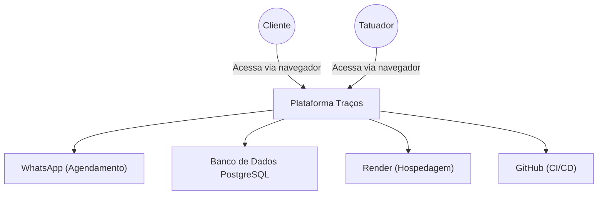
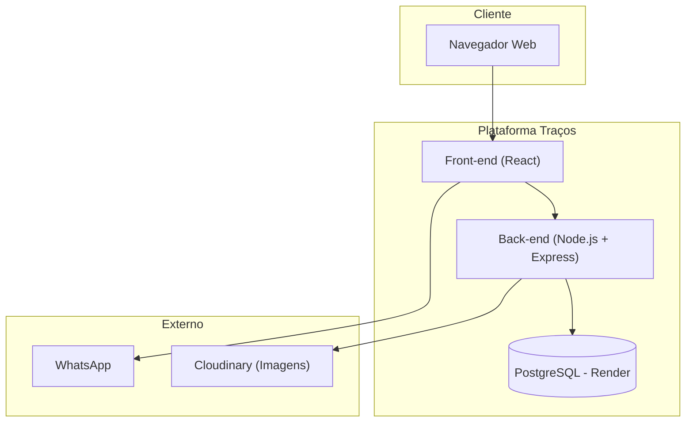
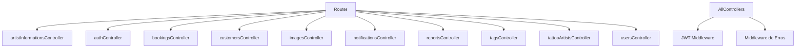
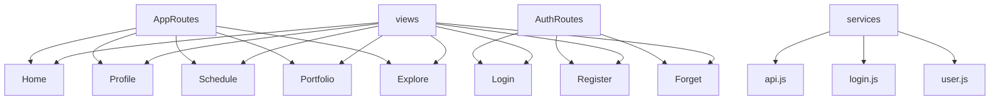

<p align="center">
  
</p>

[]()
[](https://github.com/IF977/if977-project-standards/issues)
[](https://github.com/IF977/if977-project-standards/pulls)
[](/LICENSE)

## Índice
- [Sobre o Projeto](#sobre-o-projeto)
- [Tecnologias Utilizadas](#tecnologias-utilizadas)
- [Instalação](#instalação)
- [Documentação](#documentação)
- [Funcionalidades](#funcionalidades)
- [Contribuição](#contribuição)
- [Licença](#licença)
- [FAQ](#faq)
- [Estado do Projeto](#estado-do-projeto)
- [Screenshots](#screenshots)

## Sobre o Projeto
A **Traços** é uma plataforma desenvolvida para facilitar a conexão entre tatuadores e pessoas interessadas em realizar tatuagens. A ideia surgiu ao identificar a dificuldade de encontrar artistas confiáveis, com estilos variados e boa presença digital. O projeto foi idealizado com base em entrevistas com usuários e análise do mercado, visando criar uma experiência segura, prática e intuitiva.

A plataforma oferece um espaço onde tatuadores podem expor seus portfólios e os clientes podem buscar por artistas com base em estilos, localização, disponibilidade e avaliações. Os principais diferenciais incluem o formulário de interesse com fluxo de pré-agendamento, validação de perfis de tatuadores, curadoria de conteúdos e um feed com as últimas atualizações.

## Tecnologias Utilizadas
### Front-End
- **React.js**
- **Styled Components**
- **Material UI tools**
- **Axios**
- **Google Cloud Plataform**
- **Docker**

### Back-End
- **API RESTful**
- **Node.js**
- **Express**
- **Sequelize ORM**
- **Middlewares**
- **Sistema de autenticação com tokens (JWT)**
- **Google Cloud Plataform**
- **Docker**

### Banco de Dados
- **PostgreSQL**
- Modelagem UML
- Tabelas hospedadas online

### Armazenamento de Imagens
- **Cloudinary** (upload, processamento e armazenamento)

## Estrutura Organizacional do Código (Diagramas C4)

# Modelo C4 - Projeto Traços

## Nível 1: Diagrama de Contexto


## Nível 2: Diagrama de Contêiner


## Nível 3: Diagrama de Componentes

### Back-end (Node.js + Express)


### Front-end (React)


## Documentação
- [Documentação dos requisitos](https://docs.google.com/document/d/1ulkMX2E9aWOSVUZ12nSJiSAEy9FAcX7JBakebxSeFQI/edit?usp=sharing)
- [Documentação Técnica (Back e Front)](https://docs.google.com/document/d/11KE9-wm2V4x4aKI-znj3iM3o53n2He6Ylcexex9RjmU/edit?usp=sharing)
- [Direcionais da plataforma](https://docs.google.com/document/d/1uOht5712bmhiCFvyB2QRr3JklGG0Wf7J-Z-irw2tXh4/edit?usp=sharing)
- [Protótipos no Figma](https://www.figma.com/design/izkpJRY6NBzNHrdDBZe4zf/Projeto-ESS-2024.2?node-id=1-276&p=f&t=T2j0bhM2gLKobj7w-0)
- [User Stories](https://docs.google.com/document/d/1uiDBWRM2Bh8x61BlmF_LUSoAov5ERsSb7lp1fK81aT4/edit?tab=t.0#heading=h.jcqbroa95wlb)
- [Canvas do Projeto](https://www.canva.com/design/DAGj4-6qeH0/An-tUkPrFskuGJbtFwYXNQ/edit?utm_content=DAGj4-6qeH0&utm_campaign=designshare&utm_medium=link2&utm_source=sharebutton)
- [Testes (Back)](https://docs.google.com/document/d/1e8iJzvTV9qk9TPCnOCH5nC2c24jxZm7xl5WejpJyfIg/edit?usp=sharing)
- [Postman](https://documenter.getpostman.com/view/30491735/2sB2cVeMfa)
- [Atas de Reuniões](https://github.com/labprogsam/front-tracos/blob/main/Documents/Ata_Reunioes.md)
- [Diagramas C4](https://github.com/labprogsam/front-tracos/blob/main/Documents/C4_Diagram.md)
- [Postmortem do Projeto](https://github.com/labprogsam/front-tracos/blob/main/Documents/Postmortem_Tracos.md)

## Funcionalidades
- Explorar tatuadores e publicações por estilo, localização e técnicas.
- Favoritar artistas e postagens.
- Enviar formulário de interesse para agendamento.
- Contato via WhatsApp após preenchimento do formulário.
- Validação de perfil de tatuadores com envio de documentos no primeiro acesso.
- Atualizações em tempo real via feed personalizado.
- Dashboard para gestão de portfólio, agendamentos e perfil.

## Como acessar no navegador?
**[Clique aqui](https://front-tracos-733697204679.us-central1.run.app/app/explorar) para acessar o front no navegador.**
**[Clique aqui](https://backend-node-teste-733697204679.us-central1.run.app) para acessar o backend no navegador.**

### Outros
- **Figma** (Protótipos)
- **Render** (Deploy)

## Instalação

### Pré-requisitos
Você precisa ter **Node** e o **Yarn** instalado em sua máquina. Para instalar o node [clique aqui](https://nodejs.org/en/download) Após instalado com sucesso, execute:

```bash
npm install -g yarn
```

### Passos para rodar o projeto localmente

1. Clone o repositório:
```bash
git clone git@github.com:labprogsam/front-tracos.git
```

2. Instale as dependências. Para isso, vá até a raíz do projeto que você acabou de baixar e execute:
```bash
yarn install
```

3. Crie um arquivo `.env` na raiz do projeto e copie o seguinte conteúdo:
```env
# Configurações da aplicação
PORT=3001
REACT_APP_MAIN_URL=
```

4. Inicie o projeto localmente:
```bash
yarn start
```

## Contribuição
Contribuições são bem-vindas! Para colaborar:
1. Clone o repositório e crie sua branch a partir de `dev`:
```bash
git checkout -b "feat/branch-name"
```
2. Faça suas alterações, adicione e commit:
```bash
git commit -m "Feat: Minha contribuição"
```
3. Envie para a branch remota e abra um Pull Request.

Leia as diretrizes de contribuição no [CONTRIBUTING.md](CONTRIBUTING.md).

## Licença
Este projeto está licenciado sob a Licença MIT - veja o arquivo [LICENSE](LICENSE) para mais detalhes.

## FAQ
**Como funciona o agendamento de tatuagens?**
Após preencher um formulário com detalhes da tatuagem desejada, o cliente poderá acessar um botão para contato direto via WhatsApp com o tatuador.

**Tatuadores precisam de validação?**
Sim. No primeiro acesso, tatuadores devem preencher um formulário com documentos e informações para validação de perfil antes de acessar recursos como portfólio e agendamento.

### Informações Adicionais

Este README tem como objetivo apresentar a estrutura do projeto, principais decisões técnicas, diagramas C4 e organização dos arquivos. Para acompanhar mais de perto a evolução do trabalho, acessar documentos complementares (como atas de reunião, versões anteriores, relatórios de progresso e demais materiais), consulte a pasta oficial da disciplina no Google Drive:

📂 **Acesse aqui:**  
[Documentos do Projeto - Drive da Disciplina](https://drive.google.com/drive/u/1/folders/1RIkaG9tr3MUFPjsY2Bi3DlVSgBk0n8Lz)

---

Qualquer dúvida ou sugestão de melhoria, sinta-se à vontade para contribuir.

## Estado do Projeto
A plataforma Traços encontra-se em desenvolvimento ativo. Novas funcionalidades estão sendo testadas e integradas continuamente.

## Screenshots
<p align="center">
  
  
  
</p>

## Equipe do Projeto

<div align="center">

  <table>
    <tr>
      <td align="center">
        <br/>
        <b>José Luiz</b>
      </td>
      <td align="center">
        <br/>
        <b>Juliana Serafim</b>
      </td>
      <td align="center">
        <br/>
        <b>Samuel Miranda</b>
      </td>
      <td align="center">
        <br/>
        <b>Yasmim Sales</b>
      </td>
    </tr>
  </table>

</div>

---

<p align="center">
  &copy; 2025 Universidade Federal de Pernambuco - Centro de Informática. Todos os direitos reservados.
</p>
